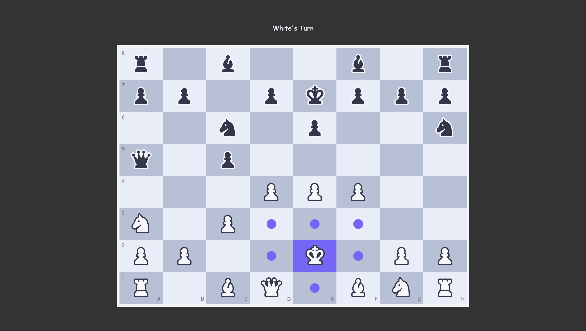
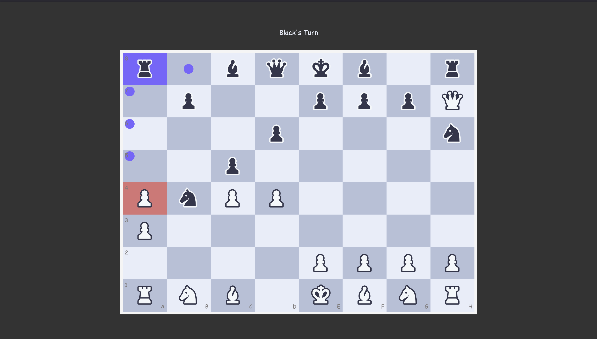
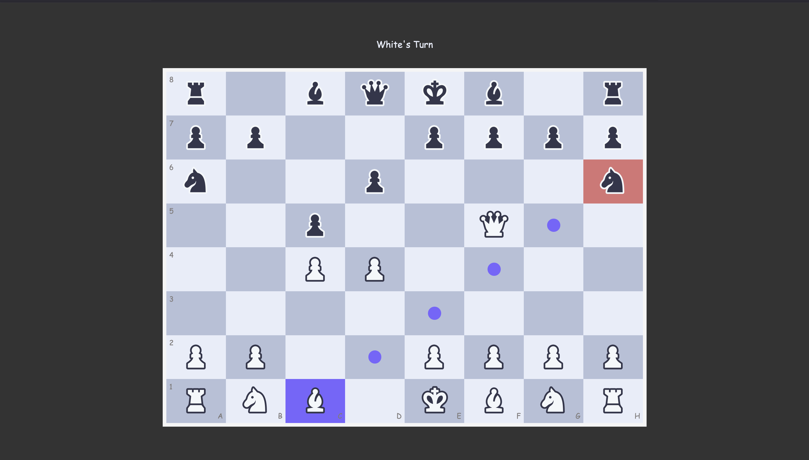
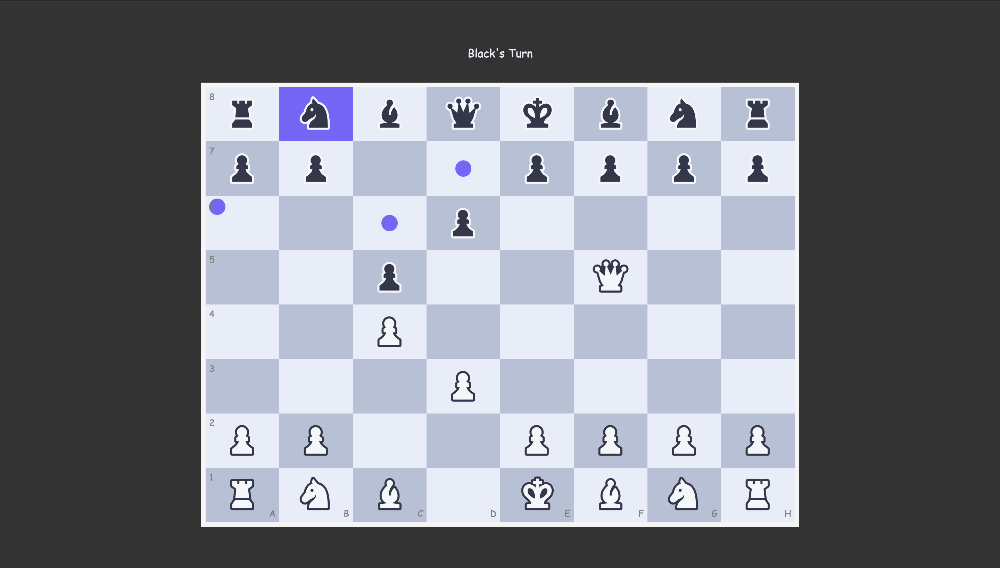
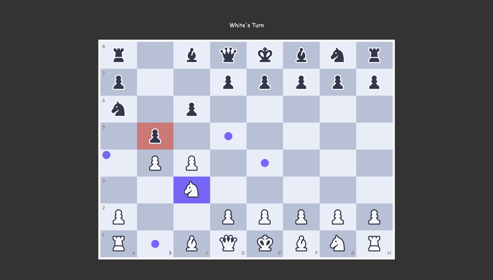
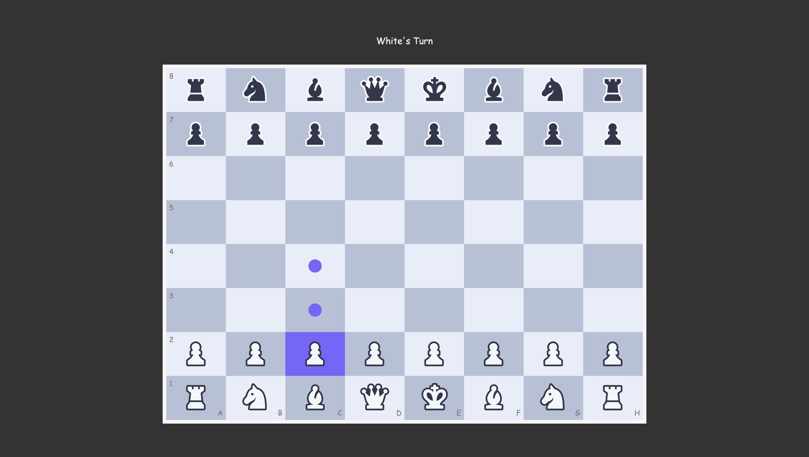
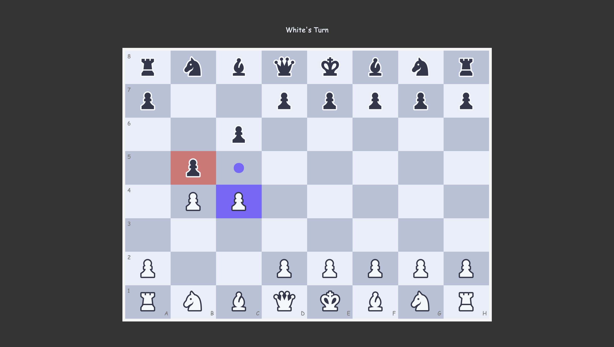

# JavaScript Chess

> A classic chess game built from the ground up with modern, vanilla JavaScript, HTML, and CSS. This project features a clean click-to-move interface and robust move validation, all without relying on any external libraries or frameworks.

## ✨ Features

  * **Complete Chess Logic:** Full implementation of a standard 8x8 chessboard with all pieces.
  * **Click-to-Move Interface:** Simple and intuitive controls—click a piece to see its valid moves, then click a highlighted square to move it.
  * **Turn-Based Gameplay:** The game enforces player turns, starting with White.
  * **Legal Move Validation:** Robust logic that correctly calculates and validates moves for all piece types:
      * **Pawn:** Including initial double push and diagonal captures.
      * **Knight, King:** "Jumping" moves that cannot be blocked.
      * **Rook, Bishop, Queen:** Sliding moves that are correctly blocked by other pieces.
  * **FEN String State:** The board state is managed internally using Forsyth-Edwards Notation (FEN), a standard in chess programming.
  * **Responsive Design:** The UI is built with modern CSS to adapt cleanly to both desktop and mobile screens.

## 🛠️ Technologies Used

The core game logic is written in **vanilla JavaScript** with no runtime dependencies.

* **HTML5:** Semantic structure for the game board and display.
* **CSS3:** Modern styling with CSS Grid, Flexbox, and Custom Properties.
* **JavaScript (ES6+):** The entire application is built on object-oriented JavaScript using Modules and Classes.

### Development Environment
* **[Vite](https://vitejs.dev/):** Used as a high-performance development server and build tool.
* **[npm](https://www.npmjs.com/):** Used for package management to handle the Vite dependency.

## 🚀 Getting Started

To run this project locally, you will need Node.js and npm installed.

1.  **Clone the repository:**
    ```bash
    git clone [https://github.com/https://github.com/wengDavo/Chess    
    ```

2.  **Navigate to the project directory:**
    ```bash
    cd your-repo-name
    ```

3.  **Install dependencies:**
    This will install Vite, which is listed in your `package.json`.
    ```bash
    npm install
    ```

4.  **Run the development server:**
    This command will start the Vite server and provide you with a local URL (usually `http://localhost:5173`).
    ```bash
    npm run dev
    ```
5. **Open the provided URL in your browser** to see the application running.

Of course. That's an excellent idea for a `README`. Highlighting the specific logic for each piece is great documentation, both for users and for other developers.

Based on your folder structure and our previous work, here is a new section you can add to your `README.md` file. It's written in Markdown format for easy copying and pasting.

-----

## ♟️ Piece Movement Logic

This section briefly outlines the movement rules implemented for each chess piece in the game. The core logic for generating potential moves can be found in `chess-pieces.js`, and the validation against the current board state is handled by `chess-board.js`.

### ♚ The King
The King moves one square in any direction (horizontally, vertically, or diagonally). The game validates that the destination square is not occupied by a friendly piece.



-----

### ♛ The Queen

The Queen is the most powerful piece. It can move any number of squares along a rank, file, or diagonal.
  * **Logic:** Implemented as a "sliding piece." Its path is blocked by the first piece (friendly or opponent) it encounters.


-----

### ♜ The Rook

The Rook moves any number of squares horizontally or vertically.
  * **Logic:** A "sliding piece" whose movement is blocked by other pieces along its path.



-----

### ♝ The Bishop

The Bishop moves any number of squares diagonally. Each bishop always stays on squares of the same color.
  * **Logic:** A "sliding piece" whose path is blocked by any piece it encounters.



-----

### ♞ The Knight

The Knight moves in an 'L' shape: two squares in one direction (horizontal or vertical) and then one square in a perpendicular direction.
  * **Logic:** The only piece that **jumps** over other pieces. Its move validation is independent of the squares between its start and end points.




-----

### ♟︎ The Pawn

The Pawn has the most complex set of rules for movement.
  * **Forward Push:** Can move one square forward if the destination is empty.
  * **Initial Double Push:** From its starting rank, it can move two squares forward if both squares are empty.
  * **Diagonal Capture:** Can capture an opponent's piece on a square one step diagonally forward. The game validates that an opponent piece must be present for a capture to be valid.
  * **Future Work:** Special moves like *En Passant* and Pawn Promotion are planned for future updates.




## 📝 Future Improvements

This project has a strong foundation. Future features to be added include:

  * **Special Moves:** Implement Castling, *En Passant*, and Pawn Promotion.
  * **Check & Checkmate:** Add logic to detect when a King is in check or when the game has ended in checkmate or stalemate.
  * **Move History:** Keep a log of all moves made during the game.
  * **UI Enhancements:** Add a "New Game" button and display captured pieces.
  * *Record a short GIF of selecting a Chess Piece and its highlighted squares*
